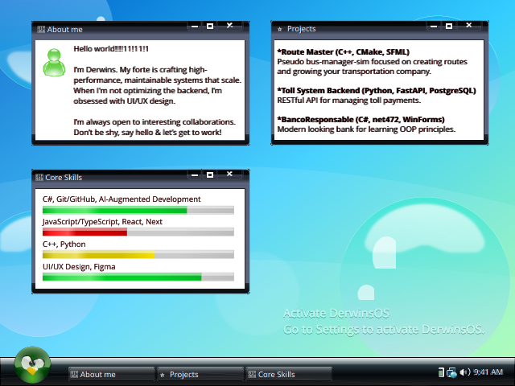

<picture>
<source media="(max-width: 768px)" srcset="profile.svg">

</picture>

<!--
# Derwins Ochoa

## 🖥️ Overview
I’m **Derwins**, a software engineer based in **Venezuela**. My forte is crafting high-performance, maintainable systems that scale. When I’m not optimizing the backend or refactoring legacy code to **.NET 10**, I’m obsessed with **UI/UX design** and creating intuitive user experiences.

I leverage **AI-augmented development** and agentic workflows to maintain high developer velocity while ensuring architectural integrity.

---

## 🛠️ Core Competencies

| Domain | Tech Stack | Proficiency |
| :--- | :--- | :--- |
| **Backend & Systems** | C# (.NET 10), C++, Python, PostgreSQL | High |
| **Frontend & Design** | React, Next.js, Tailwind, Figma (UI/UX) | High |
| **Tools & DevOps** | Git/GitHub, CMake, AI Agents (Goose), Docker | Advanced |
| **Specialized** | Reverse Engineering, SFML, FastAPI, WinForms | Active |

---

## 📂 Featured Projects

### 🚌 Route Master (C++, CMake, SFML)
* **Focus:** Performance-critical simulation logic.
* **Description:** A pseudo bus-manager-sim focused on route optimization and transportation company scaling.

### 💳 Toll System Backend (Python, FastAPI, PostgreSQL)
* **Focus:** Scalability and RESTful API design.
* **Description:** High-concurrency backend for managing real-time toll payments and transaction logging.

### 🏦 BancoResponsable (C#, .NET, WinForms)
* **Focus:** OOP Principles & UI Design.
* **Description:** A modern-looking banking application designed to demonstrate robust software architecture and clean interface design.

---

## 🤝 Let's Connect
I’m always open to interesting collaborations, especially in **system modernization** or **design-heavy engineering**.

- 📝 **Read my blog:** https://derwins8a.github.io/blog
- ⚡ **Fun Fact:** This README is currently running on **DerwinsOS v1.0**.

{
  "@context": "https://schema.org/",
  "@type": "Person",
  "name": "Derwins Ochoa",
  "alternateName": "Derwins8A",
  "url": "https://github.com/derwins8a",
  "address": {
    "@type": "PostalAddress",
    "addressCountry": "VE"
  },
  "jobTitle": "Software Engineer & UI/UX Designer",
  "knowsAbout": [
    "C#",
    ".NET 10 Modernization",
    "C++ (SFML, CMake)",
    "Python (FastAPI, PostgreSQL)",
    "Reverse Engineering",
    "AI-Augmented Software Engineering (AASE)",
    "Frutiger Aero Design & UI/UX",
    "Agentic Workflows"
  ],
  "description": "Software engineer specializing in high-performance scalable systems and intuitive UI/UX design. Expert in .NET framework modernization and C++ simulation architecture.",
  "hasOccupation": {
    "@type": "Occupation",
    "name": "Software Engineer",
    "skills": "C#, C++, .NET 10, Python, Figma, AI Agents"
  }
}
-->
